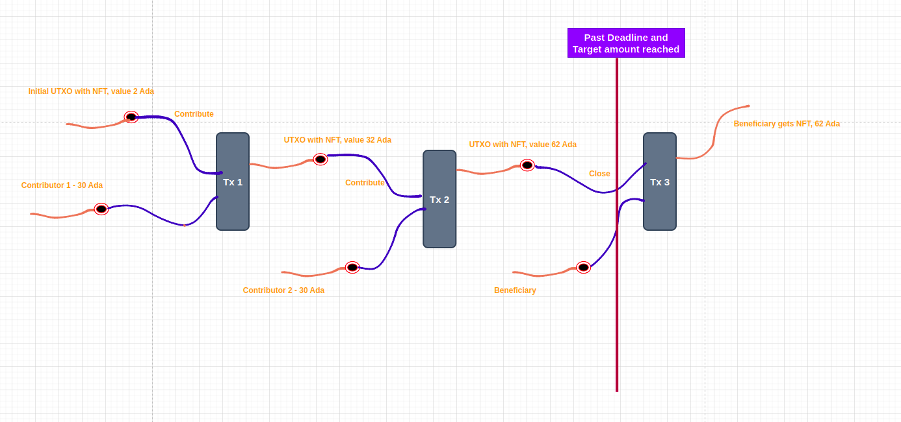

# Plutarch CrowdFunding
Optimized CrowdFunding smart contract on Plutarch


We revisit the Plutus Apps CrowdFunding project developed earlier but now use Plutarch to develop the same one.

[Plutus apps Crowdfunding](https://github.com/rchak007/CrowdFundingCardanoPlutus)


## Plutarch On Chain code

### Overview

Plutarch is an eDSL in Haskell for writing on-chain scripts for Cardano. With some caveats, Plutarch is a [simply-typed lambda calculus](https://en.wikipedia.org/wiki/Simply_typed_lambda_calculus) (or STLC). Writing a script in Plutarch allows us to leverage the language features provided by Haskell while retaining the ability to compile to compact Untyped Plutus Core (or UPLC, which is an untyped lambda calculus).

When we talk about “Plutarch scripts,” we are referring to values of type `Term (s :: S) (a :: PType)`. `Term` is a `newtype` wrapper around a more complex type, the details of which Plutarch end-users can ignore. A `Term` is a typed lambda term; it can be thought of as representing a computation that, if successfully evaluated, will return a value of type `a`.


### Why Plutarch?

Plutarch written validators are often significantly more efficient than Plutus Tx written validators. With Plutarch, you have much more fine gained control of the Plutus Core you generate, without giving up any type information.

To put things into perspective, one validator script from a large production contract was rewritten in Plutarch, changed from Plutus Tx. Here's the comparison between the Plutarch script's execution cost compared to the Plutus Tx script's execution cost. These numbers were gathered by simulating the whole contract flow on a testnet:

| Version            | CPU         | Memory  | Script Size |
| ------------------ | ----------- | ------- | ----------- |
| PlutusTx (current) | 198,505,651 | 465,358 | 2013        |
| Plutarch           | 51,475,605  | 99,992  | 489         |


[Reference]: https://github.com/Plutonomicon/plutarch-plutus#why-plutarch	"Why Plutarch"


#### Plutarch validator - Crowd Funding Smart contract 


This smart contact will help anyone who wants to raise money through Crowd Funding on public block-chain Cardano. Its generic Smart contract so anyone can use it to raise Funds. So it can be used to run as many Crowd Funding ventures as needed by anyone.  

The methodology used is an unique one and only NFT will always be present on UTXO that will gather all the crowd funded Ada. The very first time the Beneficiary (or anyone can too specifying a Beneficiary who will collect the funds) starts off with depositing an NFT at the script to kick off the Crowd Funding venture. This is the initial UTXO with NFT. This NFT is our thread token that will track this particular Crowd Funding venture.

When a contributor wants to contribute they will spend this unique UTXO with NFT and write it back to script with this NFT with any Ada already present and additionally the amount they are contributing. This is serialized in this way to keep track of Target amount. 

In the end once target is met and deadline is passed the Beneficiary can collect the funds.

The OnChain code will do all the validations necessary so this execution happens  and provide necessary safe guards and no other malicious actors can hijack the contract and drain money etc. 





#### On-Chain 

The UTXO at the script will carry this information on a Datum as a State of the crowd funding venture.


[`CrowdFundingOnChain.hs`](https://github.com/rchak007/PlutarchCrowdFunding/blob/main/src/CrowdFundingOnChain.hs)

##### Crowd Funding State (Datum)

1. Beneficiary 
   1. Beneficiary is the person who will get the funds raised by this contract. This is represented by public hash key of the Beneficiary wallet address. Only this address can get the funds.
   2. Only if the target is reached the Beneficiary can collect the amount and also past the Deadline
2. Deadline - will allow us to set a deadline for the Fund contribution and also collection. 
3. A unique one and only NFT will  manage this contract. The NFT will always sit at the UTXO that has all the Ada being collected at the script.
4. Contributors 
   1. Contributors can contribute to this Smart contract until the deadline is reached
   2. Smart contract will also keep track of who is contributing through the Contributor's public key hash and also amount they contribute. 
5. Target amount - a target amount is first specified by the beneficiary as the goal of the Crowd Funding contract. If this is not reached the Beneficiary cannot withdraw amounts.
6. Actual Target Amount so far - this represents how much was collected so far


This Crowd Funding smart contract is developed on Cardano blockchain using `Plutarch`.

This same contract can be used for multiple Crowd Funding ventures by anyone.

```haskell
data PDat (s :: S) = 
    PDat 
      ( Term 
          s 
          ( PDataRecord 
          '["beneficiary" ':= (PPubKeyHash)
          -- '["beneficiary" ':= (PAsData PPubKeyHash)
          , "deadline" ':= PPOSIXTime
          , "aCurrency" ':= PCurrencySymbol
          , "aToken" ':= PTokenName
          , "targetAmount" ':= PInteger
          , "actualtargetAmountsoFar" ':= PInteger
          , "contributorsMap" ':= PBuiltinList (PAsData (PTuple (PAsData PPubKeyHash) PInteger)) ] ))
 deriving stock (Generic)
 deriving anyclass (PlutusType, PIsData, PDataFields)
```

We represent this above Crowd Funding State as a UTxO. The UTxO sits at the script address of the Crowd Fund smart contract, and its datum field it carries the current state of the crowd funding data.

Since validation only happens when you want to consume something from a script address, not when you produce an output at a script address. This means that we can’t prevent anybody producing arbitrary outputs at the script address.

Somehow we need to distinguish the true Crowd Fund output from other outputs that may be sitting at the same script address. And the way we do this is to put an NFT on the output. Because an NFT can only exist once, there can only be one UTxO at the script address that holds the NFT.


Now, the Crowd Funding validator has to check several things.

1. Is the NFT present in the consumed input?
2. Is there an output from the transaction at the same address containing the same NFT?
3. Is the value in the output UTxO the same as the input value?
4. Is the fee present?

Now we can complete the transaction.


##### Crowd Funding Redeem Actions

Redeem actions are Contribute and Close.


```haskell
data PRedeem (s :: S) = 
      PContribute 
        ( Term 
          s 
          ( PDataRecord 
          '["contribution" ':= PInteger])) 
      | PClose (Term s (PDataRecord '[]))
 deriving stock (Generic)
 deriving anyclass (PlutusType, PIsData, PEq, PShow)
```


###### Contribute 

With this redeem action Contribtute a contributor will provide their pubKeyHash and amount they are contributing.

Also since we write the script UTXO we consume back the script we need to provide the new Datum too and this Datum's fields need to reflect the correct Value being added. So the new Datum, Redeem and actual value at script UTXO (NFT + already held Value + new contribution) should all be correctly formed. otherwise there will be error.

Note- deadline reached was commented out to make it easier for testing. But in real contracts we will have this turned on.


###### Close

Beneficiary can collect all the Ada from Crowd Fund contract when Target Amount is met and deadline is passed.


```haskell
pcrowdValidator :: Term s  (PDat :--> PRedeem :--> PScriptContext :--> PUnit)
pcrowdValidator = phoistAcyclic $ plam $ \dat redeemer ctx -> unTermCont $  do 
  ctxF <- pletFieldsC @'["txInfo", "purpose"] ctx
  PSpending ((pfield @"_0" #) -> ownRef) <- pmatchC ctxF.purpose

  PSpending pspnd <- pmatchC ctxF.purpose
  pSp0 <- pletFieldsC @'["_0"] pspnd
  -- PTxOutRef pTxoutref0 <- pmatchC pSp0._0
  -- id0 <- pletFieldsC @'["id"] pTxoutref0  
  -- PTxId ((pfield @"_0" #) -> pTxId) <- pmatchC id0.id

    -- here if a Txn is submitted with more than 1 script UTXO then this validator will be called mutiple times actually each time with 1 script UTXO to spend it.
  datF <- pletFieldsC @'["beneficiary", "deadline", "aCurrency", "aToken", "targetAmount", "actualtargetAmountsoFar", "contributorsMap" ] dat

  

  let signatories = pfield @"signatories" # ctxF.txInfo
  infoF <- pletFieldsC @'["inputs", "outputs", "signatories", "validRange"] ctxF.txInfo
-- below lines practice for subsequent lines to indicate similarity even though done bit differently
  -- vrF <- pletFieldsC @'["from", "to"] infoF.validRange
  -- PLowerBound lb0 <- pmatchC vrF.from
  -- ppos0 <- pletFieldsC @'["_0"] lb0
  -- PFinite ((pfield @"_0" #) -> pf0) <- pmatchC ppos0._0
  -----  finalPpos0 <- pletFieldsC @'["_0"] pf0  - this does not work
  PInterval iv' <- pmatchC infoF.validRange
  ivf <- pletAllC iv'
  PLowerBound lb <- pmatchC ivf.from
  PUpperBound ub <- pmatchC ivf.to
  lowerBound <- pletAllC lb
  -- PFinite pf <- pmatchC lowerBound._0
  PFinite ((pfield @"_0" #) -> pf) <- pmatchC lowerBound._0

  validR <- pletFieldsC @'["from", "to"] infoF.validRange
  -- upperB <- pletFieldsC @'["_0", "_1"] validR.to
  -- PFinite ((pfield @"_0" #) -> currTime) <- pmatch upperB
  -- PSpending ((pfield @"_0" #) -> ownRef)
  -- pFinite <- pletFieldsC @'["_0"] upperB._0
  -- let currTimeApprox = pupperBoundCurrentTimeApproximation # infoF.validRange
  -- let currTimeApprox = plowerBoundCurrentTimeApproximation # infoF.validRange
  sigs :: Term _ (PBuiltinList (PAsData PPubKeyHash)) <- pletC infoF.signatories 
  -- allInputs <- pletC infoF.inputs
  let ownInput = ptryOwnInput # infoF.inputs # ownRef      -- so this actually implicitly is only 1 possible. -- cause each SCript UTXO calls validator each time separately
  -- let ownInput = ptryOwnInput # infoF.inputs # (pfromData pSp0) 
  -- ownInput - PTxInInfo (Term s (PDataRecord '["outRef" := PTxOutRef, "resolved" := PTxOut]))
  --     Also ownInput should only be 1 and that should have the datum. 
  --     it can have other UTXO not own which are Beneficiary's for collateral eg.
  ownInputF <- pletFieldsC @'["value", "address", "datum"] ownInput 
  let inDatum = pfromPDatum @PDat # (ptryFromInlineDatum # ownInputF.datum)
  inDatumOnUtxo <- pletFieldsC @'["beneficiary", "deadline", "aCurrency", "aToken", "targetAmount", "actualtargetAmountsoFar", "contributorsMap"] inDatum 
  

  -- we construct the Value from Datum - from actualtargetAmountsoFar and our Token
  -- then we get the input Value on UTXO. the idea is these 2 has to be same. 
  -- That way no malicious actor can deposit Million tokens and make our script unusable etc.
  --    We check this on Contribution when we dont let them write back to script with extra tokens
  --    We also check on the Close. So if its something is malicious then at least later 
  --          Contributors can take back their funds.
  --     datumAdaVal is ada value of so far collected funds from the datum at UTXO.
  let datumAdaVal = Plutarch.Api.V1.Value.psingleton # padaSymbol # padaToken # inDatumOnUtxo.actualtargetAmountsoFar
  --     datumCurrSymb is out State token value constructed to compare (so this is expected as we know)
  let datumCurrSymb = Plutarch.Api.V1.Value.psingleton # (inDatumOnUtxo.aCurrency) # (inDatumOnUtxo.aToken) # (pconstant 1)
  --     datumTotalVal - is constructed value of both Collected so far and our State CrowdFund token
  --        now we can compare the input Value of UTXO and need to be same.
  let datumTotalVal = datumAdaVal <> datumCurrSymb
  --     due to technical types of Input value and Contructed datum value 
  --            we convert the values to same type to compare
  let forgetPositiveUTXOInputVal = Plutarch.Api.V1.Value.pforgetPositive ownInputF.value
  let forgetSortedDatumTotalVal = Plutarch.Api.V1.Value.pforgetSorted datumTotalVal

-- below we also do the same Value construction from Datum passed to validator - 
--    Technically this should be same as UTXO datum as Cardano network Phase 1 validation should give error
  let datumAdaVal2 = Plutarch.Api.V1.Value.psingleton # padaSymbol # padaToken # inDatumOnUtxo.actualtargetAmountsoFar
  let datumCurrSymb2 = Plutarch.Api.V1.Value.psingleton # (inDatumOnUtxo.aCurrency) # (inDatumOnUtxo.aToken) # (pconstant 1)
  let datumTotalVal2 = datumAdaVal2 <> datumCurrSymb2
  let forgetSortedDatumTotalVal2 = Plutarch.Api.V1.Value.pforgetSorted datumTotalVal2
  


-- Store the Validaton 1, 2, 13 and 16 as Bool for later as this is common between 
--     Redeem actions Contribute and Close 
  let pval_1_2_13_16 =  
            -- make sure out CrowdFund Symb and token is present and only 1 qty
            ( (pvalueOf # ownInputF.value # inDatumOnUtxo.aCurrency # inDatumOnUtxo.aToken #== 1) #&&
            -- validate the Input value is same as in Datum which is our state
              plovelaceValueOf # ownInputF.value  #== inDatumOnUtxo.actualtargetAmountsoFar   #&&  

            -- Below checks that Value constructed from Datum is equal to what is on UTXO value
                -- This way we make sure no one has deposited lot of other tokens not relevant.
                -- the bigger validation of this is when we Contribute so it does not end up on our Script  
            (forgetPositiveUTXOInputVal #== forgetSortedDatumTotalVal) #&& 
            ((forgetPositiveUTXOInputVal #== forgetSortedDatumTotalVal2))
            ) 

  PScriptCredential ((pfield @"_0" #) -> ownValHash) <- pmatchC $ pfield @"credential" # ownInputF.address
  let ownOutput = pheadSingleton #$ pfilter # (paysToCredential # ownValHash) # infoF.outputs 
  ownOutputF <- pletFieldsC @'["value", "datum"] ownOutput
  let outputDatum = pfromPDatum @PDat # (ptryFromInlineDatum # ownOutputF.datum)
  datumOnOutUtxoF <- pletFieldsC @'["beneficiary", "deadline", "aCurrency", "aToken", "targetAmount", "actualtargetAmountsoFar", "contributorsMap"] outputDatum 

  -- for the Datum on UTXO at script being spent get the total contribution as per datum on inputs UTXO
  -- let inContribDatumIntValue = pExtractContribPBuiltInList # (Plutarch.Api.V1.Tuple.pbuiltinPairFromTuple # inDatumOnUtxo.contributorsMap)
  let inContributionMap = pExtractContribPBuiltInListTuple # inDatumOnUtxo.contributorsMap
  let inContributionMapValue = Plutarch.Api.V1.Value.psingleton # padaSymbol # padaToken # inContributionMap

  -- get contribution amount from redeemer
  let redeemContrib = getContributionRedeemer # redeemer
  let redeemContribValue = Plutarch.Api.V1.Value.psingleton # padaSymbol # padaToken # redeemContrib

-- Add the contribution map from existing UTXO from input to Contribution being made in currenet Txn.
  let inDatumPlusRedeemVal = inContributionMapValue <> redeemContribValue

-- get the contribution Map constructed on the UTXO datum being written back to script on Outputs
  let outContributionMap = pExtractContribPBuiltInListTuple # datumOnOutUtxoF.contributorsMap
  let outContributionMapValue = Plutarch.Api.V1.Value.psingleton # padaSymbol # padaToken # outContributionMap

  -- Store Validation 6 for later 
  let pval_4 = 
            -- output Datum back to script CrowdFund token should be there only 1 qty
            (pvalueOf # ownOutputF.value # datumOnOutUtxoF.aCurrency # datumOnOutUtxoF.aToken #== 1)  #&&
            -- total contributions (map) on datum in output written back to script should be equal total contributions on datum on the UTXO being spent + Contribution now in Redeem
              (outContributionMapValue #== inDatumPlusRedeemVal )
                 
            -- #&& plovelaceValueOf # ownOutputF.value  #== datumOnUtxo.actualtargetAmountsoFar 

  pure $
        -- (pvalueOf # ownInputF.value # datumOnUtxo.aCurrency # datumOnUtxo.aToken #== 1)
        (pmatch redeemer $ \case
          PClose _ -> 
            pif 
              -- validation#15 
              (pelem # (datF.beneficiary) #  sigs ) -- signatories ) -- pfromData signatories)
              -- (pvalueOf # ownInputF.value # datumOnUtxo.aCurrency # datumOnUtxo.aToken #== 1)
              ( pif 
                  -- validation#14 
                  -- datumOnUtxo checks the datum on UTXO and compares the TargetAmount and what ActualTargetAmountSoFar
                  -- datF is what's passed to validator in Datum
                  (pfromData datF.actualtargetAmountsoFar #>= ( pfromData datF.targetAmount) #&&
                    pfromData inDatumOnUtxo.actualtargetAmountsoFar #>= ( pfromData inDatumOnUtxo.targetAmount) #&& 
                       pfromData inDatumOnUtxo.actualtargetAmountsoFar #>= ( pfromData inDatumOnUtxo.actualtargetAmountsoFar) )
                  ( pif 
                       pval_1_2_13_16

                      ( pif 
--                          validation#17                      
                            ((inDatumOnUtxo.deadline) #< (pfromData pf))     -- Datum is less than Slot txn - so deadline passed
                            -- (datumOnUtxo.deadline #< (pfromData pf0))
                      --     LedgerIntervalV1.contains (LedgerIntervalV1.from (deadline d)) (Contexts.txInfoValidRange txinfo)
                            -- plet redeemContrib = getContributionRedeemer # redeemer
                            (pconstant ())
                            (ptraceError "Deadline has not passed")
                      )
                            

                      --        validation#17
                                -- && traceIfFalse "Deadline not yet reached" deadlinepassed                      
                      (ptraceError "Validation 13, 16 and 1 - Input UTXO values are not equal to Datum actual target amount so far")
                  )
                  (ptraceError "targetAmount not reached on the Datums")
              )
              (ptraceError "Beneficiary signature not correct")
          PContribute pc -> 
            -- plet ( getContributionRedeemer # redeemer)  $ \redeemContrib ->
            --   plet (Plutarch.Api.V1.Value.psingleton # padaSymbol # padaToken # redeemContrib) $ \redeemContribValue ->
              ( pif 
          --   Validation # 1      This validates 3 parameters to be equal 
--               1st parameter - from actual Tx-ins Values , validates that the UTXO with NFT in its Values - 
--                       bypasses other Tx-in w/o NFT like Fees Tx-in
--               2nd parameter - Values calculated based on Datum passed to the Validator
--               3rd parametr - Values calculated from Datum at the UTXO.
--                      Technically the 2 and 3 should be ensured by Network.
--              Validation # 2 - check
--                 --Only 1 tx-in with datum allowed- other can be payment address fee etc. which dont have datum
                -- this below handles both validation 1, 2, 13 and 16
                pval_1_2_13_16
                -- plet (pfield @"contribute" # pc) $ \cr ->
                --       --  (pconstant ())
                -- (pconstant ())
                ( pif
--                  validation#4
-- --               Validates expected Values based on Datum of tx-out and tx-in - tx-in Value  + redeemer value = tx-out Value
                    pval_4 
                    (pconstant ())
                    (ptraceError "Validation 4- Input Datum contributions + Redeemer Contribution is NOT equal to Output Datum contribution")
                )
  
--             validation#6
-- --          tx-out - Datum collected amount should be updated with Tx-in amount + contributed amount
              --  && traceIfFalse "the ContributedSoFar amount has a descrepancy" correctTargetAmountSoFarDatum 
  
--                   FOr this validation the Target Amount so far has to increase in the tx-out by contribution amount. So we add that from Redeemer.
--                   This is only Datum validation. Not value. Thats done with "correctOutputValue"
                (ptraceError "Validation 13, 16 and 1 - Input UTXO values are not equal to Datum actual target amount so far")
              )

        )
```


## Unit Testing - Tasty

**Tasty** is a modern testing framework for Haskell.

It lets you combine your unit tests, golden tests, QuickCheck/SmallCheck properties, and any other types of tests into a single test suite.

Features:

- Run tests in parallel but report results in a deterministic order
- Filter the tests to be run using patterns specified on the command line
- Hierarchical, colored display of test results
- Reporting of test statistics
- Acquire and release resources (sockets, temporary files etc.) that can be shared among several tests
- Extensibility: add your own test providers and ingredients (runners) above and beyond those provided


Here is snippet of Unit testing:

```haskell
pcrowdValidatorWTest13a :: TestTree
pcrowdValidatorWTest13a = tryFromPTerm "sample validator" (pcrowdValidatorW # (pdata pubKeyHashTest1)) $ do
  [PlutusTx.toData datumCrowdVal13aCloseBuiltin, PlutusTx.toData redeemCrowdCloseBuiltin, PlutusTx.toData mockCtxVal13a] @> "It should fail when Target no reached"
       

pcrowdValidatorWTest14a :: TestTree
pcrowdValidatorWTest14a = tryFromPTerm "sample validator" (pcrowdValidatorW # (pdata pubKeyHashTest1)) $ do
  [PlutusTx.toData datumCrowdBuiltin, PlutusTx.toData redeemCrowdCloseBuiltin, PlutusTx.toData mockCtxVal14a] @> "It should fail when Target no reached"
        

main :: IO ()
main = do
  setLocaleEncoding utf8
  defaultMain $
    testGroup
      "test suite"
      [ -- pcrowdValidatorWTest ,
        -- pcrowdValidatorWTest
        -- pcrowdValidatorWTest14a
        pcrowdValidatorWTest13a

      -- , sampleFunctionTest
      ]
```


### Develop Script Contexts


```haskell
-- Validation 13 - Success - 
mockCtxVal13a :: ScriptContext
mockCtxVal13a =
  ScriptContext
    (TxInfo
      [txInVal13aScriptUtxo]                              -- input
      mempty                                             -- referenceInputs
      mempty                                             -- outputs
      mempty                                             -- fee
      mempty                                             -- mint
      mempty                                             -- dcert
      myStake1Map                                        -- wdrl   
      (interval (POSIXTime 1) (POSIXTime 2))             -- validRange
      [beneficiaryHash]                                  -- signatories - txInfoSignatories
      myRedeemer1Map                                     -- redeemers --- txInfoRedeemers
      datumCrowdVal13aMap                                        -- datums
      ""                                                 -- id 
    )
    -- (Spending (TxOutRef "" 1))
    (Spending ( lTxOutRef))
```


```haskell

-- TXInInfo
txInVal13aScriptUtxo :: LedgerApiV2.TxInInfo
txInVal13aScriptUtxo = LedgerApiV2.TxInInfo {
           LedgerApiV2.txInInfoOutRef = lTxOutRef,
           LedgerApiV2.txInInfoResolved = crTxOutVal13aTest1OutForInput
}

-- TxOut
crTxOutVal13aTest1OutForInput :: LedgerApiV2.TxOut
crTxOutVal13aTest1OutForInput = LedgerApiV2.TxOut { LedgerApiV2.txOutAddress = crAddress1,
             LedgerApiV2.txOutDatum  = (rawDatToOutputDatum datumCrowdVal13aClose), 
             LedgerApiV2.txOutReferenceScript = Nothing,
             LedgerApiV2.txOutValue =  ada70 <> minAda <> valueCsTk 

}

-- Datum
-- validation 13 a - Success
datumCrowdVal13aClose :: Dat
datumCrowdVal13aClose = Dat { 
                             beneficiary =  beneficiaryHash
                           , deadline = crowdDeadline
    -- https://preview.cardanoscan.io/token/d1c14384a6e806c521bff39b0c98518576a29727ac2b5f029cf5b9be4d7943726f776446756e64?tab=transactions
                           -- , OnChain.aCurrency = "d1c14384a6e806c521bff39b0c98518576a29727ac2b5f029cf5b9be"
                           , aCurrency = dCurrencySymbol
                           , aToken = dToken
                           , targetAmount = targetAmount
                           , actualtargetAmountsoFar = 72000000      -- 72 Ada so target reached.
                           , contributorsMap = []}
 
datumCrowdVal13aCloseBuiltin = PlutusTx.toBuiltinData datumCrowdVal13aClose

datumCrowdVal13aMap :: Map DatumHash Datum
datumCrowdVal13aMap = fromList [(DatumHash "datumCrowd", Datum datumCrowdVal13aCloseBuiltin)]
                           
                           
                           
redeemCrowdClose :: Redeem
redeemCrowdClose = Close

redeemCrowdCloseBuiltin = PlutusTx.toBuiltinData redeemCrowdClose


```

